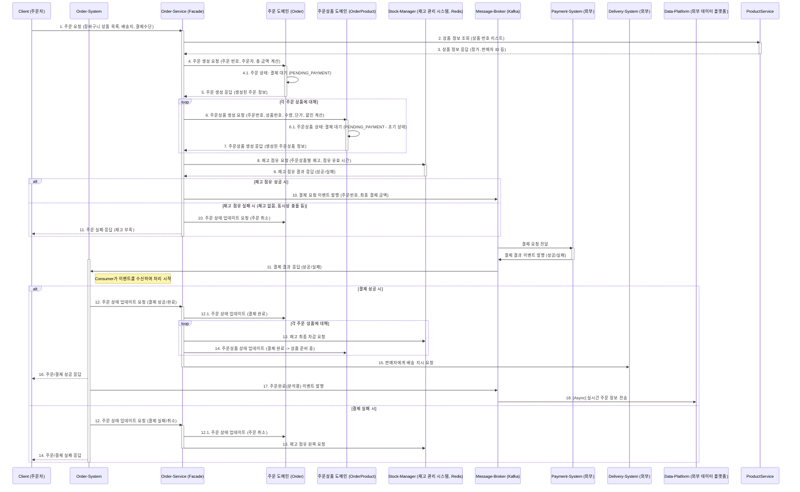
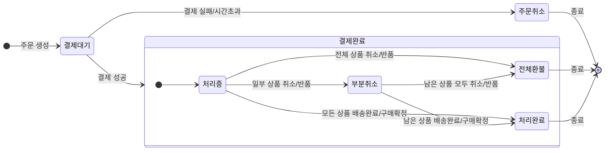
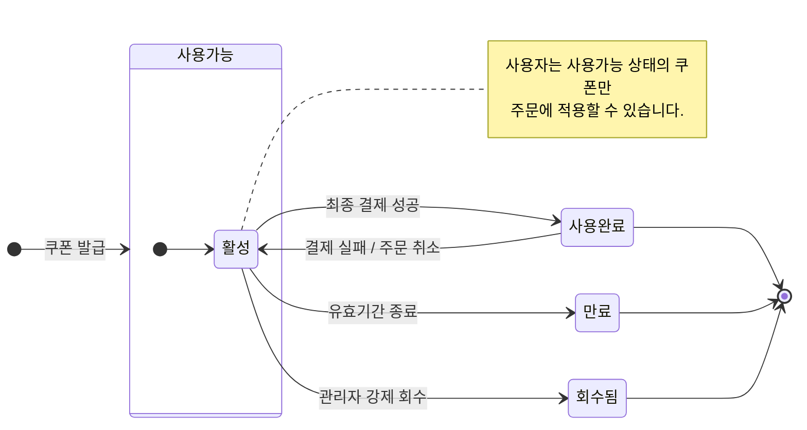

# 🛍️ E-Commerce Backend Project

## 1\. 프로젝트 소개 (Introduction)

> e-커머스 상품 주문 백엔드 서버입니다. 사용자는 잔액을 충전하고, 상품을 주문하며, 인기 상품을 추천받을 수 있습니다. 이 프로젝트는 안정적인 대규모 트래픽을 처리하기 위한 동시성 제어 및 확장 가능한 아키텍처 설계를 목표로 합니다.

[//]: # (<br>)

## 2\. 핵심 기능 (Core Features)

- **잔액 관리**: 사용자는 주문에 사용할 금액을 충전하고 현재 잔액을 조회할 수 있습니다.
- **상품 조회**: 판매 중인 상품의 상세 정보(가격, 재고 등)를 확인할 수 있습니다.
- **주문 및 결제**: 여러 상품을 한 번에 주문하고, 충전된 잔액으로 결제합니다.
- **선착순 쿠폰**: 한정 수량의 할인 쿠폰을 선착순으로 발급받아 주문 시 사용할 수 있습니다.
- **인기 상품 추천**: 최근 3일간 가장 많이 판매된 상위 5개 상품을 조회할 수 있습니다.


## 3\. Getting Started

### Prerequisites

#### Running Docker Containers

`local` profile 로 실행하기 위하여 인프라가 설정되어 있는 Docker 컨테이너를 실행해주셔야 합니다.

```bash
docker-compose up -d
```

## 4\. 도메인 모델 (Domain Model)

### 핵심 도메인

- **User**: 사용자 정보 및 잔액(Balance)을 관리합니다.
- **Product**: 상품 정보와 재고(Stock)를 관리합니다.
- **Order**: 주문 정보를 나타내며, 여러 개의 주문 항목(OrderItem)을 포함합니다.
- **Coupon**: 할인 쿠폰 정보를 관리하며, 발급 이력을 추적합니다.

[주문]
- 주문 번호
- 주문자 번호
- 주문 상태
  - 결제 대기, 결제 완료, 전체 환불, 부분 취소
- 생성일, 수정일
- 총 상품 금액 합계
- 총 상품 할인 금액 합계
- 주문 할인 금액(장바구니 할인)
- 배송비 합계
- 최종 결제 금액 (=총 상품 금액 합계 - 총 상품 할인 금액 합계 - 주문 할인 금액 + 배송비 합계)

[주문 상품]
- 주문 상품 번호(PK)
- 주문 번호(FK)
- 주문 상태
  - 결제완료, 배송준비중, 출고완료, 배송중, 배송완료, 구매확정, 취소요청, 취소처리중, 취소완료, 반품요청, 반품처리중, 반품완료, 교환요청, 교환처리중, 교환완료
- 상품 번호(FK)
- 주문 수량
- 주문 당시 상품 단가(개당 가격)
- 상품 할인 금액(상품 별 쿠폰, 즉시 할인, 프로모션 등)
- 상품 최종 금액(= 주문 당시 상품 단가 - 상품 할인 금액)
- 주문 최종 금액(= 상품 최종 금액 * 수량)
- 배송비
- 주문 순서

[주문 상품 내역]
- 주문 내역 번호(PK)
- 주문 상품 번호(FK)
- 변경 이벤트
- 변경 시점
- 변경 주체
  - 주문자, 관리자, 판매자

[사용자]
- 사용자 번호(PK)
- 사용자 이름
- 사용자 이메일
- 사용자 연락처
- 사용자 포인트 잔액
- 사용자 주소
- 사용자 구분
- 사용자 상태
  - 활성화, 정지, 탈퇴
- 사용자 생성일
- 사용자 수정일

[판매자]
- 판매자 번호(PK)
- 사용자 번호(FK)
- 사업자 명
- 사업자 등록번호
- 고객센터 연락처
- 사업자 주소
- 판매 카테고리

[상품]
- 상품 번호(PK)
- 판매자 번호(FK)
- 상품명
- 상품 설명
- 상품 가격
- 상품 재고
- 상품 상태
  - 판매 중, 품절, 판매 중지
- 상품 카테고리

[쿠폰]
- 쿠폰 번호(PK)
- 쿠폰 명
- 쿠폰 설명
- 쿠폰 종류
  - 정액 할인, 정률 할인, 무료 배송
- 쿠폰 할인 값
  - E.g., 5000, 20
- 쿠폰 유효 기간
- 쿠폰 상태
  - 사용 가능, 사용 완료, 만료
- 쿠폰 발급 수량
- 쿠폰 발급 잔여 수량
- 쿠폰 발급 시작일
- 쿠폰 발급 종료일
- 쿠폰 생성일
- 쿠폰 수정일

[쿠폰 발급 이력]
- 쿠폰 발급 번호(PK)
- 사용자 번호(FK)
- 쿠폰 번호(FK)
- 쿠폰 명
- 쿠폰 이름
- 쿠폰 설명
- 쿠폰 할인 금액
- 쿠폰 상태
  - 사용 가능, 사용 완료, 만료

## 5\. 요구사항 정의 (Requirements Definition)

### 비기능적 요구사항

- 성능
  - 인기 상품 집계 로직이 주문 처리에 영향을 주지 않도록 고려해야 합니다. (예: 별도의 스케줄링 잡, 데이터 캐싱 등)
- 확장성 
  - API 서버는 상태를 가지지 않는 무상태(Stateless)로 구현되어야 하며, 세션이나 상태 정보는 Redis와 같은 외부 저장소를 통해 관리해야 합니다.
  - 즉, 다수의 서버 인스턴스 환경에서도 모든 기능(재고, 쿠폰 등)이 정합성을 유지하며 정상 동작해야 합니다. (Stateless 지향)
- 테스트 : 모든 핵심 비즈니스 로직은 반드시 1개 이상의 단위 테스트를 포함해야 합니다.
- 동시성 제어: 특정 상품에 대한 동시 주문 요청 시, 재고가 이중으로 차감되는 문제가 발생하지 않아야 합니다.
- 데이터 정합성 (Transaction):
  - '잔액 차감'과 '재고 감소' 로직은 하나의 트랜잭션으로 처리되어, 둘 중 하나라도 실패할 경우 모두 롤백되어야 합니다.
    - 시스템 분리: 결제 성공 시 외부 데이터 플랫폼으로 주문 정보를 전송해야 하며, 이 전송 과정이 실패하더라도 이미 완료된 결제에 영향을 주어서는 안 됩니다. (예: 비동기 처리)


### 기능적 요구사항

#### 사용자 / 잔액 충전 (User / Balance Charge)

- 기능적 요구사항
  - 사용자는 자신의 잔액을 충전할 수 있어야 합니다.
  - 잔액 충전 성공 시, 해당 사용자의 잔액 정보가 즉시 업데이트되어야 합니다.
  - 사용자는 자신의 현재 잔액을 조회할 수 있어야 합니다.
  - 잔액 조회 시, 응답에는 사용자 ID와 잔액 정보가 포함되어야 합니다.
- 정책
  - 충전 금액은 0보다 커야 합니다.
  - 1회 충전 가능한 최대 금액은 1억원 미만으로 제한합니다.
  - 충전 금액의 단위는 100원 단위로 제한합니다.

#### 상품 (Product)

- 기능적 요구사항
  - 상품의 목록(ID, 이름, 가격, 잔여 수량)을 조회할 수 있어야 합니다.
- 정책
  - 재고가 0인 상품도 '품절' 상태로 함께 조회되어야 합니다.
  - 현재 '판매 중' 상태인 상품만 목록에 노출됩니다.

#### 주문 (Order)

- 기능적 요구사항
  - 사용자는 하나 이상의 상품을 선택하여 주문 및 결제를 요청할 수 있습니다.
  - 주문 성공 시, 주문 내역이 시스템에 저장되어야 합니다.
  - 결제 성공 시, 결제 내역이 시스템에 저장되어야 합니다.
  - 주문 및 결제 성공 시, 사용자의 잔액이 차감되고 상품의 재고가 감소해야 합니다.
- 정책
  - 주문자와 상품을 받는 사용자가 동일함을 전제합니다. 즉, 배송지 또는 수령인 정보는 별도로 제공받지 않습니다.
  - 주문 상품의 주문 상품별 상태에는 다음과 같은 상태가 존재합니다.
  - 아래와 같은 예외 상황에서는 주문/결제가 실패하고 명확한 예외가 발생해야 합니다.
    - 주문하려는 상품이 존재하지 않을 경우
    - 특정 상품의 재고가 주문 수량보다 부족할 경우
    - 사용자의 잔액이 총 주문 금액보다 부족할 경우

#### 주문서 (Order Sheet)

- 기능적 요구사항
  - 결제가 이뤄지기 전에 계약서 같은 것
- redis에 ttl을 설정하고 저장한다.
- cookie 사용하면 안되나? 데이터를 저장하기 위함이라면.. redis에 저장하는 이유는 주문서에서 결제까지의 트래픽을 실시간으로 감지하기 위함이다.
  만약 결제까지 이뤄지지 않는 비율이 높다면 alert이 가기도 한다.

#### 쿠폰 (Coupon)

- 기능적 요구사항
  - 사용자는 선착순 쿠폰 발급을 요청할 수 있습니다.
  - 사용자는 동일한 선착순 쿠폰을 중복하여 발급받을 수 없습니다.
  - 사용자는 자신이 보유한 유효한 쿠폰 목록을 조회할 수 있습니다.
- 정책
  - 쿠폰은 선착순으로 발급되며, 정해진 수량만큼만 발급됩니다.
  - 쿠폰은 발급 후 유효 기간이 있으며, 유효 기간이 지난 쿠폰은 자동으로 만료됩니다.
  - 

#### 인기 상품 (Popular Products)

- 기능적 요구사항
  - 최근 3일간 가장 많이 판매된 상위 5개 상품 목록을 조회할 수 있어야 합니다.
- 비기능적 요구사항
- 정책
  - '가장 많이 팔린'의 기준은 판매된 '상품의 총수량'입니다.
  - '최근 3일'의 기준은 오늘을 포함한 3일입니다.

---


## 6\. 아키텍처 (Architecture)

### 시스템 아키텍처

`[추후 추가 예정]`

### 패키지 구조

`[추후 추가 예정]`

## 6\. 설계 문서 (Design Documents)

### 주요 기능 시퀀스 다이어그램

#### 6-1. 주문 및 결제


#### 6-2. 선착순 쿠폰 발급

`[선착순 쿠폰 발급 시퀀스 다이어그램 이미지를 여기에 첨부하세요.]`

### 상태 다이어그램

- **주문(Order) 상태 변화**


- **쿠폰(Coupon) 상태 변화**


### ERD (Entity-Relationship Diagram)


## 7\. API 명세 (API Specification)

> **[API 문서 바로가기 (Link to Swagger)]**

### 공통 응답 코드 설계

| HTTP Status | 응답 코드 (Code) | 메시지 (Message)             | 설명                                     |
| :---------- | :--------------- | :--------------------------- | :--------------------------------------- |
| `200 OK`    | `SUCCESS`        | `요청에 성공했습니다.`       | 처리에 성공한 경우                       |
| `400 Bad Request`|`INVALID_REQUEST` |`잘못된 요청입니다.`|필수 파라미터 누락, 형식 오류 등|
| `404 Not Found`  | `ENTITY_NOT_FOUND` | `대상을 찾을 수 없습니다.`   | 존재하지 않는 리소스를 요청한 경우       |
| `409 Conflict`   | `STOCK_NOT_ENOUGH` | `재고가 부족합니다.`         | 재고 부족으로 주문이 불가능한 경우       |
| `500 Server Error`|`INTERNAL_SERVER_ERROR`|`서버에 문제가 발생했습니다.`|예상치 못한 서버 내부 오류|


## 8\. 테스트 전략 (Test Strategy)

- **단위 테스트 (Unit Test)**: 각 클래스 및 메소드의 기능을 독립적으로 검증합니다. 모든 비즈니스 로직은 최소 1개 이상의 단위 테스트를 포함합니다.
- **통합 테스트 (Integration Test)**: 여러 컴포넌트(주로 DB 연동)가 결합된 상태에서의 동작을 검증합니다.
- **API 테스트 (API Test)**: 실제 API 엔드포인트를 호출하여 요청부터 응답까지 전체 흐름을 검증합니다.


